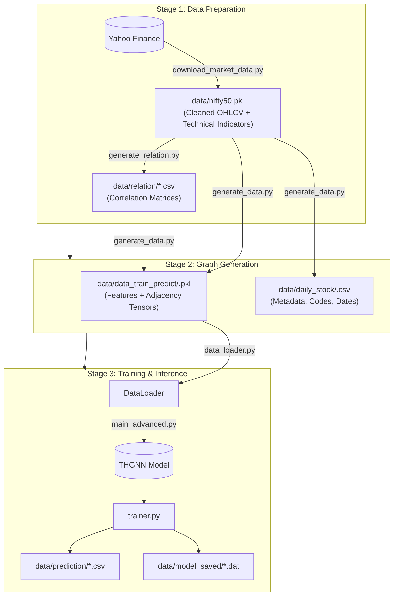
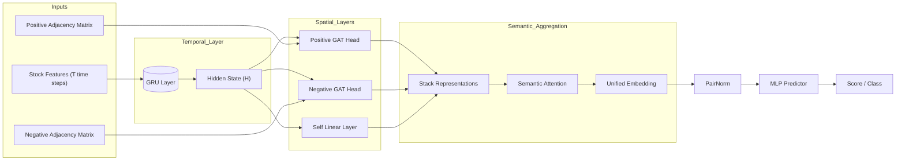

# THGNN Codebase Explanation & Architecture

This document provides a comprehensive technical overview of the **Temporal and Heterogeneous Graph Neural Network (THGNN)** repository. It covers the data processing pipeline, model architecture, and training workflow.

## 1. System Architecture Pipeline

The system operates in a sequential pipeline: gathering data, determining stock relationships, building graph snapshots, and finally training the model.



---

## 2. Directory Structure

| Directory | Key Files | Description |
| :--- | :--- | :--- |
| **`model/`** | `Thgnn.py`, `Thgnn_flexible.py` | Contains the PyTorch neural network definitions. `Thgnn_flexible.py` is the robust version that handles variable feature sizes. |
| **`utils/`** | `download_market_data.py` | Downloads stock data and calculates indicators (RSI, MACD, etc). |
| | `generate_relation.py` | Computes correlation between stocks to build the graph edges. |
| | `generate_data.py` | Fuses features and relations into daily graph snapshots for the model. |
| **`trainer/`** | `trainer.py` | Contains the training and evaluation loops (`train_epoch`, `eval_epoch`) and loss functions. |
| **`root`** | `main_advanced.py` | The main entry point. Orchestrates loading, initialization, training, and plotting. |
| | `data_loader.py` | efficient `PyTorch Dataset` class for loading the pickled graph files. |

---

## 3. Model Architecture (THGNN)

The model is designed to capture both time-series trends (using GRU) and inter-stock relationships (using Heterogeneous GAT).

### Data Flow within the Model

1.  **Input**: Shape `(Batch, Sequence_Length, Features)`
2.  **Temporal Encoding**: Processed by a **GRU** to get a single vector representation per stock.
3.  **Spatial Aggregation**:
    *   **Positive GAT**: Aggregates info from positively correlated stocks.
    *   **Negative GAT**: Aggregates info from negatively correlated stocks.
4.  **Semantic Attention**: Learns how to weigh the importance of "Self" vs "Positive Neighbors" vs "Negative Neighbors".
5.  **Prediction**: An MLP produces the final score (e.g., predicted return).



---

## 4. Key Script Details

### `main_advanced.py` (The Orchestra)
This is the recommended entry point. It adds significant functionality over the legacy `main.py`.

*   **Date-Based Indexing**: You can specify `train_end_date="2024-01-01"` instead of calculating array indices manually.
*   **Automatic Visualization**: It generates `loss_curve.png` and backtest metric plots in `data/plots/`.
*   **Walk-Forward Training**: It can optionally retrain the model on the entire history to predict the very next "live" step.

### `model/Thgnn_flexible.py` vs `Thgnn.py`
*   **Standard (`Thgnn.py`)**: Has hardcoded input dimensions (often `in_features=6`). If your data has 7 columns (e.g., you added Moving Averages), it crashes.
*   **Flexible (`Thgnn_flexible.py`)**: During the first forward pass, it checks the input shape. If it doesn't match the GRU's expected size, it **automatically re-initializes** the GRU layer to fit the data. This makes it "plug-and-play" for different experiments.

---

## 5. How to Run (Workflow)

### Step 1: Get Data
```bash
# Download last 4 years of Nifty 50 data
python utils/download_market_data.py --start 2020-01-01 --end 2024-01-01
```

### Step 2: Build Relations
```bash
# Calculate correlations (who moves with whom?)
python utils/generate_relation.py --window 20
```

### Step 3: Create Graph Snapshots
```bash
# Create the .pkl files for PyTorch
python utils/generate_data.py --window 20 --horizon 1
```

### Step 4: Train
```bash
# Run training and see results
python main_advanced.py
```
